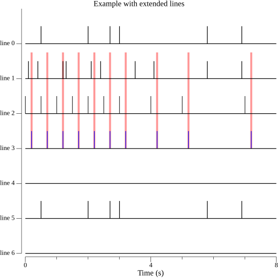
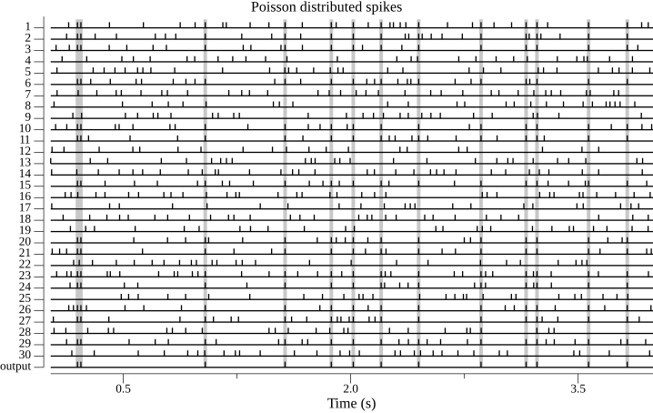
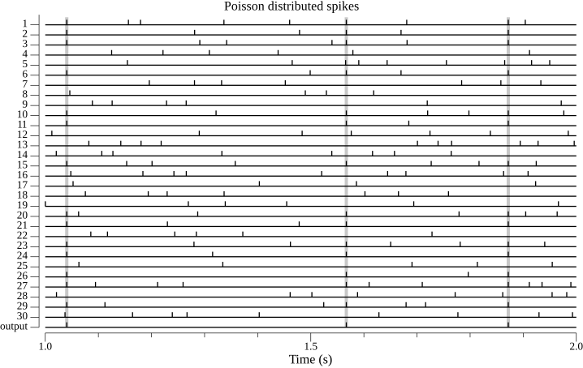

# Plot packages

The plot package provides functions to create lines or spike plots.

## Installation

To use this package execute `go get "github.com/chmike/plots"` the terminal after you executed the `go mod init` instruction.

## Line plots

A line plot is a conventional plot with lines, lines with points or simply points. It is possible to specify the line color, width, dashing, as well as the point glyph, color and size.

One may use the `plot.Add(p *plot.Plot, l plots.Line)`command to add a line to your plot, or use the `plots.MakeLinePlot(l plots.Lines, fileNames ...string)`command.

You may then generate of the following plots. The test code shows how to set the line properties.

## Spike plots

Spike plots are used for Spiking Neural Networks (SNN) studies.

This package provides the function `MakeSpikePlot` to create such plots. It makes
it possible to also draw bars extending multiple spike lines to emphasis coincidences.

The following plot is a more realistic use case with Poisson distributed spikes and
20ms refractory period.

The following plot shows that one can easily select a sub-time range to display in
the plot.

